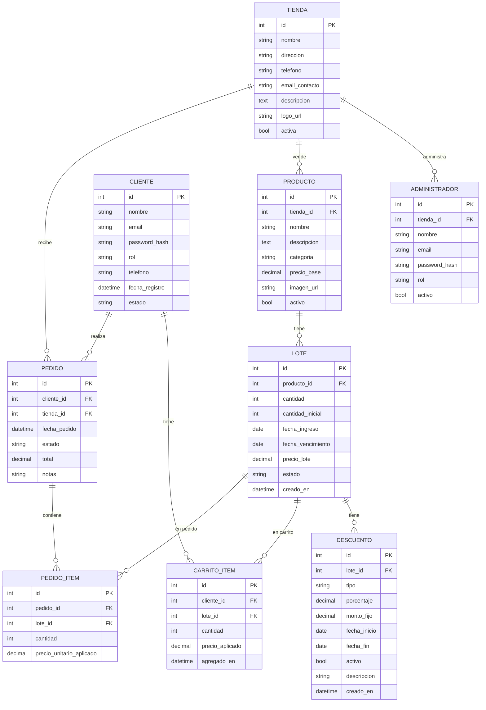

# Diagrama Entidad-Relación — Fressco

## Notas de diseño

### Tabla `descuentos`
- `tipo = "automatico_por_vencimiento"`: generado por la lógica escalonada del sistema
- `tipo = "manual_admin"`: creado explícitamente por el administrador
- Un descuento manual activo **siempre tiene precedencia** sobre el automático
- Solo puede existir un descuento manual activo por lote en un período dado

### Snapshot de precios
- `carrito_items.precio_aplicado`: precio con descuento al momento de agregar al carrito
- `pedido_items.precio_unitario_aplicado`: precio con descuento al momento de confirmar el pedido
- Ambos son **inmutables**: no se recalculan aunque cambie el descuento del lote

### Control de stock
- `lotes.cantidad`: stock actual disponible
- `lotes.cantidad_inicial`: referencia histórica (nunca cambia)
- La reserva de stock se hace con `SELECT FOR UPDATE` (atomicidad bajo concurrencia)
- Estado `agotado` se activa automáticamente cuando `cantidad = 0`
